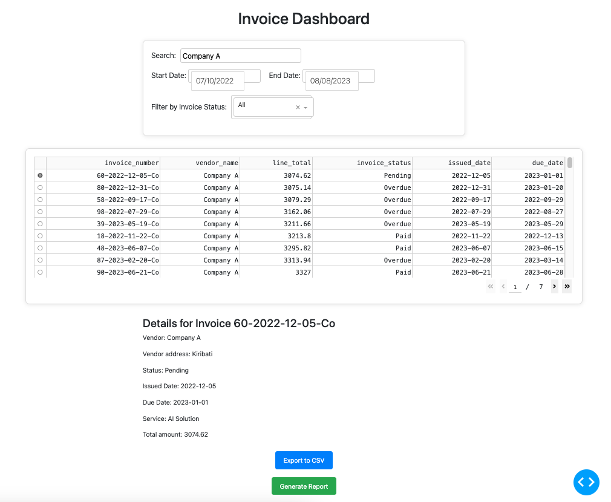
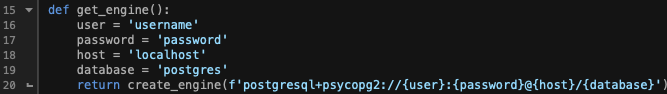

# Invoice Automation



## Overview

This project is a basic yet functional invoice management system utilizing PostgreSQL and Dash for an interactive dashboard. It includes scripts for cleaning data, creating tables, inserting data, and setting up indexes in PostgreSQL. The Dash application provides an interactive interface to filter invoices, generate reports, and export selected data to CSV format. This setup offers foundational capabilities for invoice management and data visualization.

## Project Structure

- **data/**: Contains raw and cleaned datasets used in the analysis, as well as CSV files exported from Dash and generated reports.
- **scripts/**: Includes SQL and Python scripts for data processing and visualization.
  - **db_scripts/**: SQL scripts for database setup, data insertion, and exporting data.
  - **python_scripts/**: Python scripts for data cleaning.
  - **web/**: Python scripts for the Dash application.
  
## Cloning the Repository

To clone this repository to your local machine, use the following command:

```bash
git clone https://github.com/tymoteuszmilek/Invoice-Automation.git
```

## Setup Instructions

1. **Navigate to the project directory**:
    ```bash
    cd Invoice-Automation
    ```
2. **Install the required Python packages**:
    ```bash
    pip install -r requirements.txt
    ```
3. **Navigate to the `python_scripts` folder and run the data cleaning script**:
    ```bash
    cd scripts/python_scripts
    python3 clean_data.py
    ```
4. **Navigate to the `db_scripts` folder and log in to PostgreSQL**:
    ```bash
    cd ../db_scripts
    psql -U [username] [database_name]
    ```
5. **Create a new database and connect to it**:
	```sql
	CREATE DATABASE [database_name];
	\c [database_name]
	```
6. **Execute the database initialization script**:
    ```sql
    \i run_initializer.sql
    ```
6. **Navigate to the `web` folder and update the database configuration in the Dash app script**:
	
    ```bash
    cd ../web
    ```
7. **Run the Dash application**:
    ```bash
    python3 app.py
    ```

## Data Description

The datasets used are from [Invoices Data](https://www.kaggle.com/datasets/ghassenkhaled/invoices-data) on Kaggle. The data includes various invoices.


## License

This project is licensed under the MIT License. See the [LICENSE](https://github.com/tymoteuszmilek/Invoice-Automation/blob/main/LICENSE.md) file for details.
  
